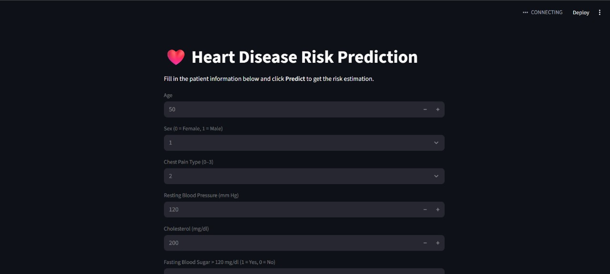
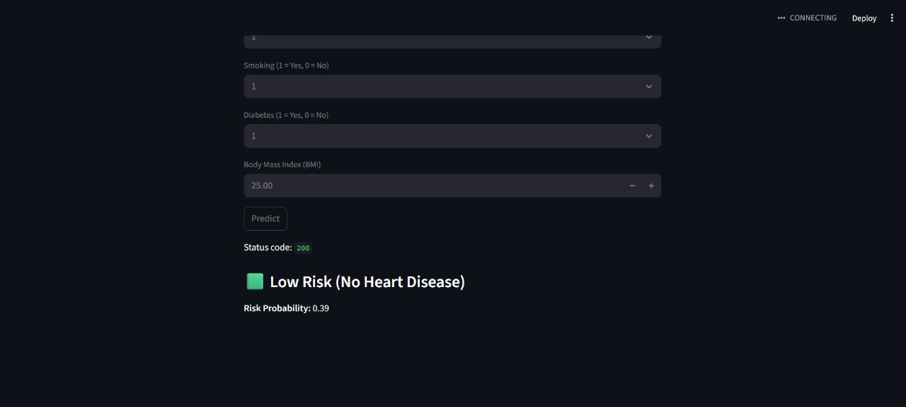

````markdown
# Heart Disease Prediction System (NHA-011)

This repository contains a complete machine learning project for predicting **heart disease** based on patient clinical features.

The system includes:

- Data preprocessing and model training (Jupyter Notebook)
- Saved optimized ML model (`.pkl`)
- Backend API for serving predictions
- Simple UI that interacts with the API
- Screenshots, report, and presentation files

---

## 📁 Project Structure

```text
NHA-011/
│
├── app.py                       # Backend API for model inference
├── ui.py                        # Frontend / UI that calls the API
├── best_model_optimized.pkl     # Final optimized machine learning model
├── final_heart_model.pkl        # Previous / baseline trained model
├── final_depi_mil4.ipynb        # Jupyter notebook: EDA, training, evaluation
├── prediction_logs.csv          # Example prediction logs (inputs + outputs)
├── README.md                    # Project documentation (this file)
│
├── docs/
│   ├── Final_Project_Report.pdf                 # Full written report
│   └── Heart-Disease-Prediction-presentation.pdf  # Project presentation slides
│
└── screenshots/
    ├── 1.jpg   # Web interface home page
    ├── 2.jpg   # API running in the backend
    └── 3.jpg   # Final prediction result (disease / no disease)
````


## 🔍 Project Description

The goal of this project is to build a system that predicts whether a patient is likely to have **heart disease (`1`)** or **not (`0`)** based on a set of clinical features.

### Main Features

* Supervised classification model trained on a heart disease dataset.
* Full pipeline: data preprocessing → model training → evaluation → saving the best model.
* Final model saved as `best_model_optimized.pkl` for fast inference.
* Backend API (`app.py`) that receives patient data and returns a prediction.
* Simple UI (`ui.py`) where the user fills in a form and sees the prediction result.
* Optional logging of predictions into `prediction_logs.csv` for later analysis.

---

## 📊 Dataset

The model is trained on a structured heart disease dataset with columns such as:

* **Age**
* **Sex**
* **Chest pain type**
* **Resting blood pressure**
* **Serum cholesterol**
* **Fasting blood sugar**
* **Resting ECG results**
* **Maximum heart rate achieved**
* **Exercise induced angina**
* **ST depression & slope**
* **Number of major vessels**
* **Thalassemia**
* **Target** (`0` = no heart disease, `1` = heart disease)

The dataset is loaded and processed in the notebook:

* `final_depi_mil4.ipynb`

---

## 🧠 Model Training

All steps for training and evaluating the model are inside:

* `final_depi_mil4.ipynb`

The notebook includes:

1. **Data loading**
2. **Exploratory Data Analysis (EDA)**
3. **Data preprocessing**

   * Handling missing values
   * Encoding categorical features
   * Feature scaling (if used)
   * Splitting data into training and test sets
4. **Model training**

   * Trying different algorithms (e.g. Logistic Regression, Random Forest, XGBoost, etc. – depending on your implementation)
5. **Model evaluation**

   * Accuracy, precision, recall, F1-score
   * Confusion matrix and other plots
6. **Model selection**

   * Choosing the best-performing model
   * Saving it as `best_model_optimized.pkl` using `pickle` / `joblib`

`final_heart_model.pkl` may contain an earlier / baseline version of the model used during experimentation.

For a full explanation of the methodology and results, see:

* `docs/Final_Project_Report.pdf`
* `docs/Heart-Disease-Prediction-presentation.pdf`

---

## ⚙️ Technologies Used

* **Programming Language:** Python
* **Data & ML:**

  * `pandas`, `numpy`
  * `scikit-learn`
  * `xgboost` (if used)
* **Visualization (EDA):**

  * `matplotlib`, `seaborn`
* **Model persistence:**

  * `pickle` / `joblib`
* **Backend API:**

  * Implemented in `app.py` (e.g. FastAPI / Flask or a standard Python HTTP server)
* **Frontend / UI:**

  * Implemented in `ui.py` (e.g. Streamlit or custom Python UI)
* **Logging:**

  * CSV logs stored in `prediction_logs.csv`

> 📌 Check the imports at the top of `app.py`, `ui.py`, and `final_depi_mil4.ipynb` for the exact libraries used.

---

## 🚀 Getting Started

### 1️⃣ Clone the Repository

```bash
git clone <REPO_URL>
cd NHA-011
```

### 2️⃣ (Optional) Create a Virtual Environment

```bash
python -m venv venv

# Windows
venv\Scripts\activate

# Linux / macOS
source venv/bin/activate
```

### 3️⃣ Install Dependencies

If a `requirements.txt` file is provided:

```bash
pip install -r requirements.txt
```

Otherwise, install the main dependencies manually, for example:

```bash
pip install numpy pandas scikit-learn matplotlib seaborn
pip install xgboost           # only if used in the notebook
pip install fastapi uvicorn   # if the backend uses FastAPI
pip install flask             # if the backend uses Flask
pip install streamlit         # if the UI is built with Streamlit
```

Remove libraries you don’t need based on your actual code.

---

## 🌐 Running the Application

The system usually runs in **two parts**: the **backend API** and the **UI**.

> 🔎 Check `app.py` and `ui.py` for the exact commands used in your setup.
> Below is a common pattern.

### 1️⃣ Start the Backend API

From the project directory:

```bash
# Example: simple script
python app.py
```

If using FastAPI with Uvicorn, it may look like:

```bash
uvicorn app:app --reload
```

After starting, the API will run on a local address such as:

```text
http://127.0.0.1:<PORT>
```

(Replace `<PORT>` with the port used in your code.)

### 2️⃣ Start the UI

Run the UI in a **separate terminal**:

```bash
# Example: simple Python UI
python ui.py
```

If the UI is built with Streamlit, it may use:

```bash
streamlit run ui.py
```

Open the URL printed in the terminal (e.g. `http://localhost:8501`).

---

## 🧪 How to Use the System

1. Make sure the **backend API** (`app.py`) is running.

2. Start the **UI** (`ui.py`) and open it in your browser.

3. Fill in the patient’s clinical data in the form fields.

4. Click **Predict** (or the corresponding button).

5. The UI sends the data to the backend API.

6. The backend loads `best_model_optimized.pkl`, makes a prediction, and returns:

   * `0` → Patient is **not likely** to have heart disease.
   * `1` → Patient is **likely** to have heart disease.

7. If logging is enabled, the input features and the corresponding prediction are appended to `prediction_logs.csv`.

---

## 🖼️ Screenshots

### 1. Web Interface (Home Page)



---

### 2. Backend API Running


---

### 3. Prediction Result (Patient Diagnosis)



---

## 🧾 Documentation

For more detailed information about:

* Problem definition
* Dataset description
* Model comparison and evaluation metrics
* Discussion, limitations, and conclusions

refer to:

* `docs/Final_Project_Report.pdf`
* `docs/Heart-Disease-Prediction-presentation.pdf`

---
 

## 📜 License & Disclaimer

> This project was developed for **educational purposes** and course evaluation.
> It is **not** intended to be used as a real medical diagnostic tool or to replace professional medical advice.


```
